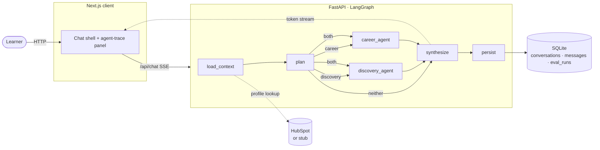

# Meridian

> **Meridian**: the line along which disconnected things align. The orchestration layer that pulls independent learner-facing agents onto a single path, so one learner question gets one coherent answer.

A learner asking a compound question — _"What program is right for me, and what jobs does it lead to once I graduate?"_ — should not have to bounce between unconnected chat agents. Meridian routes the query across a Discovery and a Career agent in parallel, pulls live CRM context from HubSpot, and synthesizes a **single** streamed response.

The design rationale lives in [`docs/rfc.md`](docs/rfc.md). This README is operator-facing — how to run it, where the pieces live.

---

## Live

| Surface | URL                                                                                       |
| ------- | ----------------------------------------------------------------------------------------- |
| **App** | [https://meridian-one-mu.vercel.app](https://meridian-one-mu.vercel.app)                  |
| **API** | [https://meridian-g-q4wg.fly.dev](https://meridian-g-q4wg.fly.dev) (`/health` for status) |

The deployed app runs against real HubSpot (5 seeded learner contacts) with SQLite on a Fly Volume. Open the URL, pick a learner, ask the compound query above — the trace panel renders the orchestration live.

---

## Architecture



Six LangGraph nodes. Discovery and Career run in parallel when the planner chooses `both`. Only the synthesizer's tokens reach the SSE wire — internal agent outputs stay server-side so the learner sees one coherent response, not three concatenated ones. A seventh `title` task runs async after the response is delivered, off the streaming wire.

See [`docs/rfc.md`](docs/rfc.md) §4 for the full architecture rationale (why LangGraph, why SSE, model-per-role split, CRM resilience).

---

## What's in the box

| Folder          | Stack                                                                 |
| --------------- | --------------------------------------------------------------------- |
| `server/`       | FastAPI + LangGraph orchestrator, SQLAlchemy/Alembic, OpenAI, HubSpot |
| `client/`       | Next.js 16 (App Router) + React 19, Tailwind v4, shadcn/ui, Zustand   |
| `server/evals/` | Golden dataset + `run_evals.py` (routing accuracy + LLM-as-judge)     |
| `docs/`         | `rfc.md` — full design RFC, decisions + alternatives considered       |

What's real vs stubbed:

| Surface                            | Deployed (production path)             | Local default (clone-and-run)            |
| ---------------------------------- | -------------------------------------- | ---------------------------------------- |
| LLM (planner, agents, synthesizer) | OpenAI — **real**                      | OpenAI — **real**                        |
| CRM                                | HubSpot — **real** (5 seeded contacts) | Stub (5 seeded learners, deterministic)  |
| Database                           | SQLite on Fly Volume at `/data`        | SQLite file at `server/data/meridian.db` |

The stub CRM is included for offline development and deterministic evals; the deployed app uses the real HubSpot API end-to-end. Switch locally via `CRM_PROVIDER=hubspot` + `HUBSPOT_ACCESS_TOKEN`.

---

## Quick start

Two terminals. The Next.js route handlers proxy through to FastAPI, so the browser never talks to the backend directly.

### 1. Server (`localhost:8000`)

```bash
cd server
uv sync
cp .env.example .env             # fill in OPENAI_API_KEY; CRM_PROVIDER=stub works offline
uv run alembic upgrade head      # creates conversations + messages + eval_runs tables
uv run uvicorn app.main:app --reload --port 8000
```

Verify:

```bash
curl http://localhost:8000/health
curl http://localhost:8000/learner/stub-001
```

See [`server/README.md`](server/README.md) for the full endpoint table, CRM provider switch, and layout. (Note: local dev binds port 8000; the Fly container binds 8080 — both are normal.)

### 2. Client (`localhost:3000`)

```bash
cd client
pnpm install
cp .env.example .env             # API_URL=http://localhost:8000 by default
pnpm dev
```

Open <http://localhost:3000>. Pick a learner from the header, ask a question, and watch the orchestration trace render alongside the streamed answer.

---

## Evals — "how would you know it's getting better or worse?"

A 15-case golden dataset under [`server/evals/`](server/evals/) exercises the orchestrator end-to-end and scores two things:

1. **Routing accuracy** — did the expected agent set fire? (deterministic; comparison of `agents_invoked` against the labelled expectation)
2. **Response quality** — LLM-as-judge (gpt-4o-mini, temp=0) scores each response 1-5 against a per-case rubric.

Run it:

```bash
cd server
uv run python -m evals.run_evals             # ~$0.10 in API cost end-to-end
uv run python -m evals.run_evals --dataset golden_v1 --min-routing-accuracy 0.85
```

Results land in three places:

- A markdown table at `server/evals/results/<dataset>-<ts>.md`
- The `eval_runs` table (per-case scores, routing decisions, latency, judge reasoning in `extra` JSON)
- stdout summary + non-zero exit when routing accuracy < threshold — usable as a CI gate

**Current scores (v1, 15-case golden):** routing accuracy **87%**, mean response quality **4.60/5**. Two known misses categorised in `evals/results/`: one labelling ambiguity (program-comparison queries can route to either `discovery` or `both`) and one conservative routing (planner asks for clarification on bare job titles). Both have one-line v2 fixes documented in the memo.

The dataset breakdown: 5 discovery, 5 career, 3 compound, 2 edge (off-topic + ambiguous). Stub CRM so the run is reproducible and free of HubSpot rate limits.

What v2 would add: human-review sampling (5% of real traffic, captured back into the dataset), regression gate in GitHub Actions (block merges on >3pp drop), per-agent evals isolated from orchestration, weekly drift canary against gpt-4o silent updates. RFC §7 has the full plan.

---

## Tests

| Suite           | What it covers                                                                                     | Command                                         |
| --------------- | -------------------------------------------------------------------------------------------------- | ----------------------------------------------- |
| Server (pytest) | Repo CRUD, conversation API, title generation (LLM mocked), routing, schemas, stub CRM, HubSpot CB | `cd server && uv run pytest`                    |
| Client (e2e)    | Happy path: load → send → trace + cost badges → reload persists → rename → delete → mobile + 404   | `cd client && pnpm test:e2e`                    |
| Evals           | Routing accuracy + LLM-judged response quality across 15 cases                                     | `cd server && uv run python -m evals.run_evals` |

The Playwright suite spawns both servers via its `webServer` config and reuses already-running ones if present.

---

## Productionizing at big scale (~10k learners and growing)

Meridian's orchestration layer and CRM integration are production-shaped already; the gaps are scale, security, durability, and operational maturity — not foundational re-architecture. The migration path: **(1)** Migrate SQLite → Postgres (Supabase/Neon/self-hosted) — existing Alembic migrations run against the new DB, dump-and-restore data, change `DB_URL`; application code unchanged. This unlocks horizontal autoscaling, transactional backups, row-level security for multi-tenancy. **(2)** Add **Redis** for conversation-context caching, intent-classifier result caching for repeat queries, and HubSpot response caching to stay well under rate limits. **(3)** Promote **LangSmith** to a hard production dependency (the env-var hook is wired in v1; v2 adds team-shared traces, historical search, routing-accuracy drift alerts) and add **Sentry** for error tracking. **(4)** **CI eval gate** in GitHub Actions running `evals.run_evals` so routing-accuracy regressions block merges. **(5)** **PII redaction** at the gateway before any learner data reaches LLM providers. **(6)** **Auth** via Auth0 / Supabase Auth with row-level security on `conversations` + `messages`. **(7)** **Per-tenant rate limiting** for institutions serving partner schools. **(8)** Replace Fly free tier with a paid org, autoscaling tied to request volume, staging + canary deploys. **(9)** **Durability** — Litestream for any SQLite service, or managed-Postgres backups with point-in-time recovery + multi-region replicas. Estimated effort: **2-3 weeks for one engineer**, mostly security hardening and observability — the orchestration architecture itself is production-shaped already.

See RFC §10 for the long-form version with cost projections and §8 for the top-three production risks (cost, hallucination, integration brittleness) and their mitigations.

---

## AI assistance disclosure

The architecture and design decisions in [`docs/rfc.md`](docs/rfc.md) — scenario choice, orchestrator shape, model split, CRM resilience pattern, scope cuts, productionization plan, success metrics — are mine. The implementation was paired with **Claude Code** (Opus 4.7) as a fast-fingers collaborator: I drove the design and judgment calls; Claude drafted code from my specs, ran the toolchain, and surfaced issues I then resolved.

Concretely:

- **Hand-authored:** the RFC, all architecture decisions, the eval rubric design, the SSE event protocol, the CRM circuit-breaker contract, the model-per-role split, scope cuts.
- **AI-drafted then reviewed:** LangGraph wiring, FastAPI route handlers, SQLAlchemy models + repos, Alembic migrations, Pydantic schemas, the conversation history sidebar (React + Zustand), the chat shell SSE consumer, the agent-trace panel, the eval harness, pytest + Playwright happy-path tests.
- **Verified by:** running tests (`pytest`, `pnpm test:e2e`), reading diffs, exercising the UI in a browser at multiple viewports, and a Playwright-assisted UI inspection pass.

Most production engineering today is a collaboration like this. The point of disclosing it is so the reviewer can see exactly where my judgment ended and the assistant's drafting began.

---

## Reading order

1. [`docs/rfc.md`](docs/rfc.md) — design rationale, alternatives considered, scope cuts. Start here if you want to understand _why_ the system is shaped this way.
2. [`server/README.md`](server/README.md) — operator runbook for the orchestrator: endpoints, env vars, layout, CRM switch.
3. [`client/README.md`](client/README.md) — operator runbook for the chat UI.
4. [`server/evals/`](server/evals/) — the golden dataset and `run_evals.py` script.
